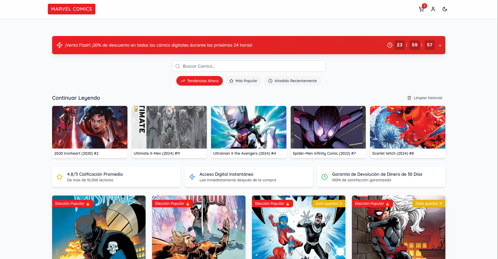
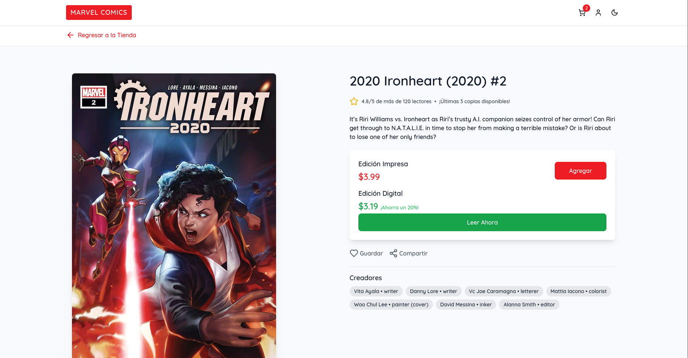
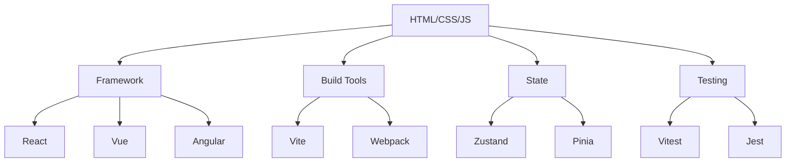

# Mi travesía en el Desarrollo Web

Una historia de código, aprendizaje y perseverancia

  
    Inicia el viaje 🚀 <carbon:arrow-right class="inline"/>
  

---
layout: image-right
image: ./images/linkedin-profile-min.jpg
---

# ¿Quién soy?

<v-clicks>

- 👋 Soy Francisco J. Lopez
- 💻 Full Stack Developer (8 años de experiencia)
- 🎯 Especializado en Frontend
- 🎓 Egresado del ITSTB en Sistemas Comunicacionales
- 🔐 Activista por la Privacidad y la Seguridad Digital
-  Entusiasta de Bitcoin y Blockchain

</v-clicks>

---
layout: two-cols
---

# Mi Experiencia Universitaria

Lo que me llevé de la universidad:
<v-clicks>

- 🔥 Fundamentos sólidos de programación
- 🎯 Programación Orientada a Objetos
- 📊 Metodologías Ágiles (Scrum)
- 💎 Principios SOLID
- ⛁ Base de Datos
- 🧠 Patrones de Diseño

</v-clicks>

::right::

<v-click>

# Mi Mantra 🧘‍♂️

  

    "Aprender a programar es fácil y divertido"
  

</v-click>

---
layout: cover
background: 'linear-gradient(135deg, #000428 0%, #004e92 100%)'
---

# Experiencia Laboral

<v-clicks>

  <h3>Numenarts</h3>
  
Full Stack Developer

  
HTML/CSS/JS, PHP, MySQL

  <h3>BBVA</h3>
  
Full Stack Developer

  
Web Components, Polymer, Java

  <h3>Linko</h3>
  
Frontend Developer

  
Vue, React, TypeScript

  <h3>SkyAirlines</h3>
  
Frontend Developer

  
Microfrontends, Storybook, Vue 3, ButterCMS

</v-clicks>

---
layout: image-left
image: https://images.pexels.com/photos/3183150/pexels-photo-3183150.jpeg
---

# Evolución Profesional

<v-clicks>

- 🌐 Transición al trabajo remoto post-pandemia (uso de herramientas digitales)
- 📚 Nunca pares de aprender
- 📈 Certificaciones y cursos en línea
- 🔍 Investigación de tendencias del mercado
- 💼 LinkedIn como herramienta fundamental
- 🤖 Talently: IA en la búsqueda laboral

</v-clicks>

---
layout: two-cols
---

# Ejemplo Práctico: Proyecto de Cómics de Marvel

  
Desarrollé una aplicación web que consume la API de Marvel para mostrar una lista de cómics. La aplicación incluye:

  <ul>
    <li>Interfaz responsiva y estética.</li>
    <li>Lista de cómics con imágenes y títulos.</li>
    <li>Navegación a detalles del cómic con descripción y imagen ampliada.</li>
    <li>Optimización para velocidad y escalabilidad.</li>
  </ul>
  
Instrucciones y requerimientos:

  <ol>
    <li>Diseño y estructura a discreción.</li>
    <li>Funciones para mejorar la experiencia del usuario.</li>
    <li>Código reutilizable y optimizado.</li>
  </ol>

::right::

  <a href="https://marvel-comics-explorer.netlify.app" target="_blank">Tienda de Comics de Marvel</a>
  
  

---
layout: center
background: 'radial-gradient(circle at center, #4a148c 0%, #311b92 100%)'
---

  <h1 class="text-6xl font-bold bg-clip-text text-transparent bg-gradient-to-r from-purple-400 via-pink-500 to-red-500 mb-8">
    Mapa de Ruta para el Éxito
  </h1>
  

    <carbon:arrow-down class="text-4xl text-blue-400"/>
  

---
layout: default
---

# Perfiles en Demanda

<v-clicks>

  <h3>Frontend</h3>
  
HTML/CSS/JS, Vue, React, Astro, UI/UX,

  <h3>Backend</h3>
  
Node.js, Python, BDD, APIs

  <h3>DevOps</h3>
  
CI/CD Tools, Docker, Linux (Bash), Nginx, Cloud Providers

  <h3>Mobile</h3>
  
Android, iOS, React Native, Flutter

  <h3>AI Engineer</h3>
  
ML, Deep Learning, Big Data

  <h3>Data Analyst</h3>
  
SQL, Python, Tableau

  <h3>Cloud Architect</h3>
  
AWS, Azure, GCP

  <h3>Security Engineer</h3>
  
Cybersecurity, Pentesting

  <h3>Blockchain Dev</h3>
  
Solidity, Web3.js

</v-clicks>

---
layout: center
---

# Frontend Developer Roadmap
### Basado en [roadmap.sh](https://roadmap.sh)

---
layout: cover
background: 'linear-gradient(135deg, #000428 0%, #004e92 100%)'
---

# Recursos de Aprendizaje

<v-clicks>

  <h3>🎓 Plataformas</h3>
  <ul class="text-sm" style="list-style-type: none;">
    <li>Udemy</li>
    <li>Platzi</li>
    <li>freeCodeCamp</li>
    <li>Code With Mosh</li>
  </ul>

  <h3>📚 Libros</h3>
  <ul class="text-sm" style="list-style-type: none;">
    <li>"Eloquent JavaScript" - Marijn Haverbeke</li>
    <li>"You Don’t Know JS" - Kyle Simpson</li>
    <li>"Clean Code" - Robert C. Martin</li>
    <li>"Javascript para programadores impacientes" - Dr. Axel Rauschmayer</li>
  </ul>

  <h3>👥 Comunidades</h3>
  <ul class="text-sm" style="list-style-type: none;">
    <li>Dev.to</li>
    <li>Stack Overflow</li>
    <li>GitHub</li>
    <li>Meetup</li>
    <li>Midudev</li>
  </ul>

  <h3>📜 Certificaciones</h3>
  <ul class="text-sm" style="list-style-type: none;">
    <li>AWS Certified</li>
    <li>Azure Fundamentals</li>
    <li>Google Cloud</li>
  </ul>

</v-clicks>

---
layout: default
---

# Redes

<v-clicks>

  <h3>📧 Contacto</h3>
  
Si tienes preguntas o deseas más información, no dudes en contactarme:

  
Email: <a href="mailto:fcojavierlpz91@gmail.com">fcojavierlpz91@gmail.com</a>

  <h3>📞 Número de Contacto</h3>
  
Puedes llamarme o enviarme un mensaje al siguiente número:

  
Número: <a href="tel:+527776356753">+52 777 635 6753</a>

  <h3>🔗 LinkedIn</h3>
  
Conéctate conmigo en LinkedIn:

  
Perfil: <a href="https://www.linkedin.com/in/francisco-j-lopez-developer" target="_blank">in/francisco-j-lopez-developer</a>

  <h3>🌐 Página Web</h3>
  
Visita mi página web para más información:

  
Sitio: <a href="https://fcojavierlpz.online" target="_blank">fcojavierlpz.online</a>

</v-clicks>

---
layout: center
class: text-center
---

# ¡Gracias por su atención!

  

    "El único modo de hacer un gran trabajo es amar lo que haces" - Steve Jobs
  

  

    
      ¿Preguntas? 🤔
    
  

